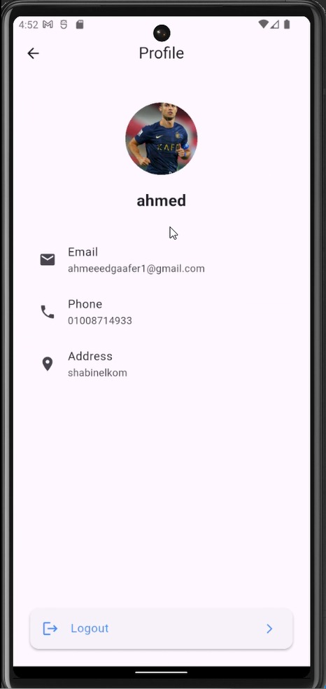

# ElectroCommerce Flutter App

This project is a final e-commerce application built using **Flutter**. It supports essential e-commerce features including:

- User Registration & Login (with API Integration)
- Product Listing (via API)
- Category Filtering
- Cart Management (with persistent SharedPreferences)
- Order History
- Profile Page with local image and saved data
- 
## Table of Contents

- [Overview](#overview)
- [Features](#features)
- [Screenshots](#screenshots)
- [App Structure](#app-structure)
- [Getting Started](#getting-started)
- [Developer](#developer)
- [Notes](#notes)
- [Acknowledgments](#acknowledgments)

---
## Features

- **Authentication:**  
  - User Registration & Login (مع تكامل API)
- **Product Catalog:**  
  - Product Listing (عبر API)
  - Category Filtering
- **Cart System:**  
  - Cart Management (حفظ تلقائي في SharedPreferences)
  - Offline-safe cart persistence
- **Order Management:**  
  - View and track order history
- **Profile:**  
  - Profile page (تعديل صورة المستخدم المحلية وحفظ البيانات)
- **UI/UX:**  
  - Modern, responsive UI with BlueAccent theme
  - Placeholder images for missing API images

---
## Screenshots

  
|   |   |   |
|---|---|---|
|  |  |  |
|  |  |  |
|  |  |  |

---

## Developer

Developed by: **Ahmed Mohamed Gaafer**
[LinkedIn](https://www.linkedin.com/in/ahmedgaafer/) | [GitHub](https://github.com/ahmedgaafer1)
## Structure

- `lib/screens`: Contains all UI screens (Login, Register, Home, Cart, Orders)
- `lib/data`: Global state and shared preferences data
- `lib/models`: Data models for Products and Cart Items
- `lib/services`: API service integration for products and categories

## Notes

- Offline-safe cart and order persistence using SharedPreferences
- Placeholder images handle missing API images
- Main color theme: `BlueAccent`

---

> This project is part of the ITI Final Flutter Course Assignment under the supervision of Eng. Ibrahim
